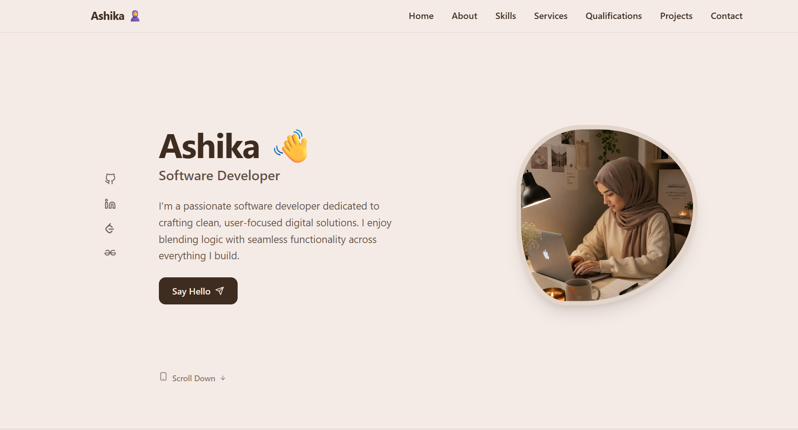
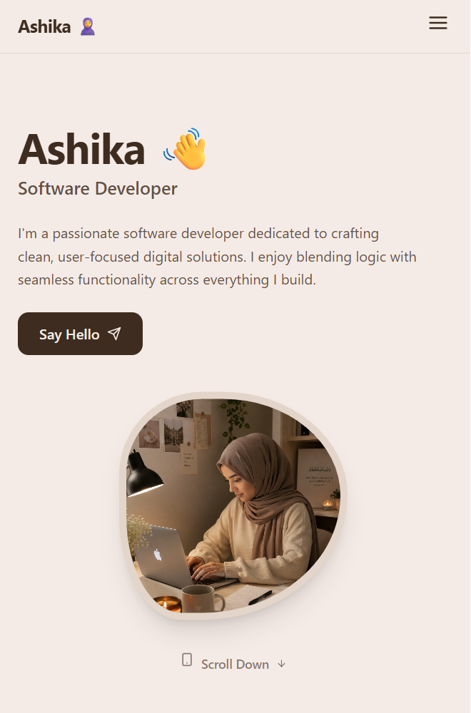

# 🌐 My Professional Portfolio

Welcome to my portfolio website! This project is a responsive, modern web application built to showcase my technical expertise, software engineering projects, and development journey.

🔗 **Live Demo:** [ashika-portfolio-me.vercel.app](https://ashika-portfolio-me.vercel.app/)

---

## 📸 Screenshots & Preview

Here is a visual walkthrough of the portfolio user interface.

### 🖥️ Desktop View
> **Home & Hero Section**
> 
> 

### 📱 Mobile Responsiveness
> **Mobile Menu & Compact View**
> 
> 
> 
> 

---

## 🚀 Key Features

* **Responsive Design:** Optimized for a flawless viewing experience across desktops, tablets, and smartphones.
* **Modern UI/UX:** Clean, intuitive interface featuring smooth transitions, hover effects, and accessible navigation.
* **Project Gallery:** A dedicated, interactive showcase highlighting my key web applications and logic-building repositories.
* **Dynamic Competency Matrix:** Structured presentation of my technical skills categorized by core proficiency.

---

## 🛠️ Tech Stack & Tools

* **Frontend:** ReactJS, Vite, HTML5, CSS3, JavaScript (ES6+)
* **Styling & Assets:** Modern CSS / Responsive Layouts
* **Hosting & Deployment:** Vercel

---

## 🧠 Core Focus & Learning Path

This portfolio serves as a living document of my continuous adaptation and growth. My current development priorities include:
* **Full-Stack Architectures:** Building scalable applications leveraging the MERN stack.
* **Algorithmic Thinking:** Refining problem-solving capabilities through Data Structures & Algorithms (DSA).
* **AI-Assisted Workflows:** Incorporating next-generation AI tooling to optimize code quality and development velocity.

---

## 🤝 Let's Connect!

I am always eager to collaborate on exciting projects, discuss open opportunities, or talk about modern web technologies.

* **Email:** ashika.a359@gmail.com
* **GitHub:** [github.com/Ashika45](https://github.com/Ashika45)
* **LinkedIn:** [linkedin.com/in/ashika-a43a76288/](https://www.linkedin.com/in/ashika-a43a76288/)

---

## 🔒 License & Copyright

© Ashika. All rights reserved.

**Strictly Confidential.** Unauthorised copying, modification, distribution, or cloning of this repository's source code via any medium is strictly prohibited. The code is proprietary and solely intended to showcase my personal professional work.

---
*Built with precision using React & Vite.*
